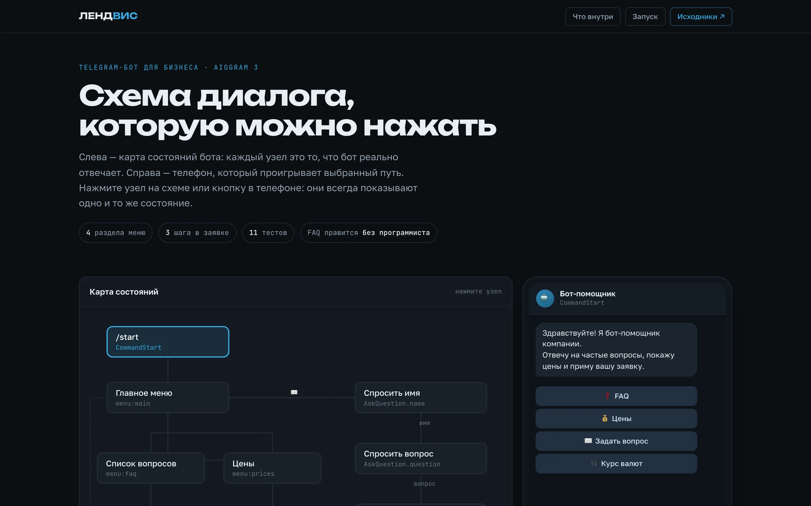
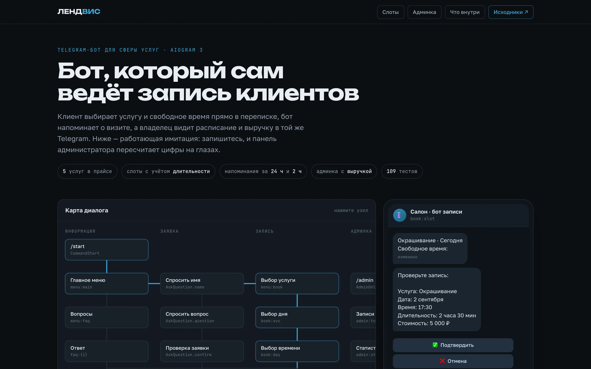
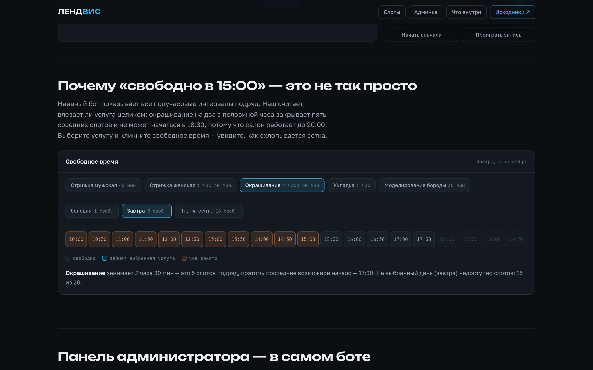
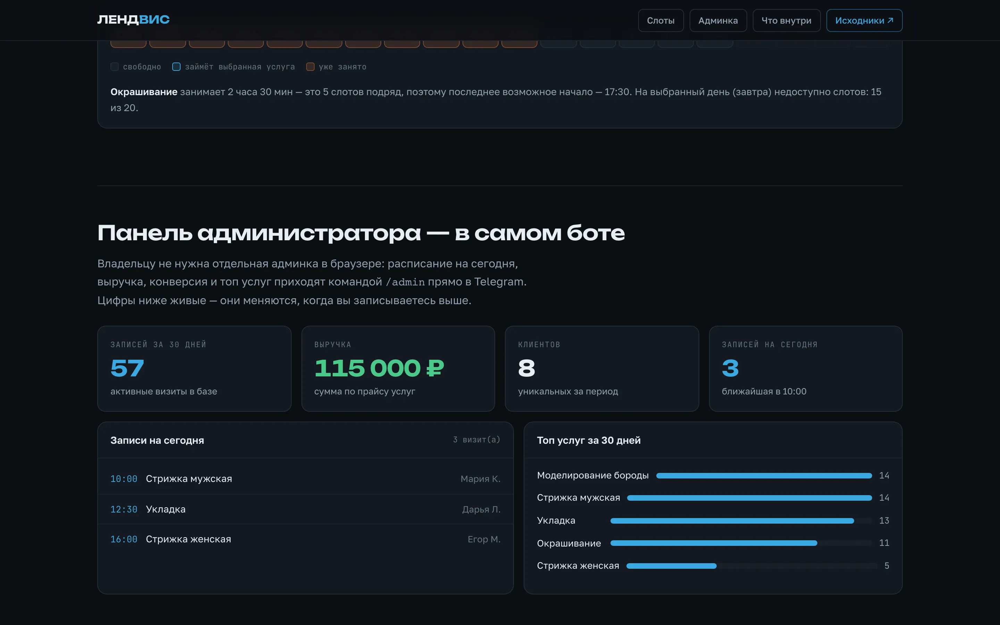
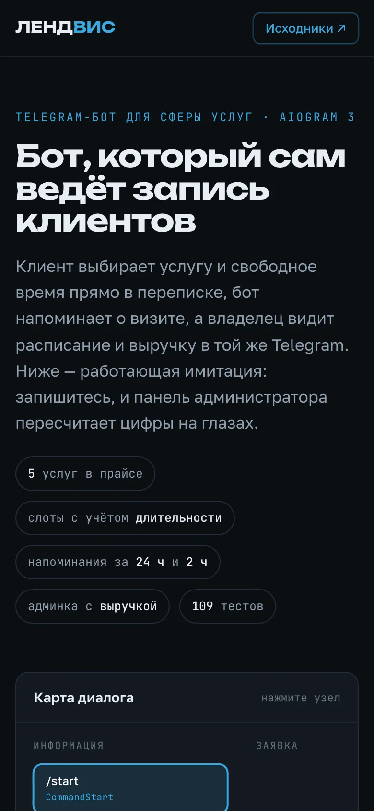

# Бот записи клиентов для сферы услуг (aiogram 3)

**[Открыть живую витрину →](https://olegg000.github.io/python-faq-bot/)**

> **EN (summary).** A Telegram booking bot for service businesses (salons, studios,
> workshops), built with aiogram 3 and SQLAlchemy 2. Clients pick a service and a free
> slot right in the chat; slots are computed from the service duration, so a 150-minute
> job blocks five neighbouring half-hour slots and cannot start too close to closing
> time. A partial unique index makes a double booking impossible under a race. The bot
> reminds clients 24 h and 2 h before the visit, and the owner gets an in-chat admin
> panel: today's schedule, 30-day revenue, conversion, top services, service toggles and
> throttled broadcasts. 109 tests, none of which need network or a real token.

[](https://olegg000.github.io/python-faq-bot/)

Бот берёт на себя запись клиентов: показывает услуги, считает свободное время,
принимает визит, напоминает о нём и отдаёт владельцу статистику — всё внутри
Telegram, без отдельного сайта и админки в браузере.

## Возможности

### Для клиента
- **Запись в три касания** — услуга → день → свободное время → подтверждение.
- **Честные слоты** — время показывается только если услуга успевает целиком
  до конца смены и не пересекается с чужими визитами.
- **Свои записи и отмена** — визит можно отменить самому, но не позже чем
  за `CANCEL_DEADLINE_HOURS` часа; бот объяснит правило, а не промолчит.
- **Напоминания** за 24 часа и за 2 часа до визита.
- **Частые вопросы** — ответы правит владелец в `data/faq.json`, без программиста.
- **Заявка менеджеру** — диалог имя → вопрос → подтверждение.

### Для владельца
- **Панель в боте** (`/admin`, доступ по `ADMIN_IDS`): записи на сегодня,
  статистика за 30 дней (записи, выручка, новые клиенты, топ услуг, конверсия),
  управление прайсом и рассылка.
- **Рассылка** с паузами между отправками; заблокировавшие бота помечаются
  в базе и исключаются из следующих рассылок.
- **Уведомления** о каждой новой записи, отмене и заявке — в чат `MANAGER_CHAT_ID`.

## Витрина

На [странице проекта](https://olegg000.github.io/python-faq-bot/) можно записаться
самому: карта состояний диалога синхронизирована с телефоном, сетка слотов считается
той же арифметикой, что в боте, а панель администратора пересчитывает выручку сразу
после записи.

| Запись в чате | Арифметика слотов |
|---|---|
|  |  |





Страница повторяет логику бота, но к Telegram не подключается — это имитация
сценария, а не работающий бот в браузере.

## Как считается свободное время

Слот годится, только если выполняются все условия:

1. услуга целиком помещается до конца рабочего дня (`WORK_END`);
2. интервал `[начало, начало + длительность)` не пересекается ни с одним
   активным визитом — с учётом длительности **того** визита;
3. время ещё не прошло.

Поэтому окрашивание на 2,5 часа закрывает пять получасовых слотов подряд и не может
начаться в 18:30 при работе салона до 20:00. Если двое подтверждают одно время
одновременно, второй получает понятное «это время только что заняли»: в базе стоит
частичный уникальный индекс на активные записи, и гонка ловится на уровне СУБД,
а не надеждой на удачу.

## Структура проекта

```
python-faq-bot/
├── bot/
│   ├── __main__.py     # точка входа (python -m bot)
│   ├── config.py       # конфигурация из переменных окружения
│   ├── models.py       # таблицы: клиенты, услуги, записи, заявки
│   ├── db.py           # движок и сессии SQLAlchemy
│   ├── repo.py         # вся работа с данными, включая расчёт слотов
│   ├── seed.py         # стартовый прайс при первом запуске
│   ├── middlewares.py  # сессия БД, антифлуд, логирование
│   ├── scheduler.py    # напоминания за 24 ч и 2 ч
│   ├── rates.py        # RateProvider: demo + exchangerate API
│   ├── handlers/
│   │   ├── common.py   # меню, FAQ, цены, курсы, заявка
│   │   ├── booking.py  # запись, мои записи, отмена
│   │   └── admin.py    # панель владельца
│   └── services/
│       ├── notify.py   # уведомления менеджеру
│       └── broadcast.py# рассылка с паузами и учётом блокировок
├── data/faq.json       # вопросы и ответы FAQ (редактируется без кода)
├── tests/              # 109 тестов (pytest)
├── docs/               # витрина проекта (GitHub Pages)
├── Dockerfile
├── docker-compose.yml
├── .env.example        # образец конфигурации
└── requirements.txt
```

## Запуск

```bash
git clone https://github.com/Olegg000/python-faq-bot.git
cd python-faq-bot

python3 -m venv venv
source venv/bin/activate      # Windows: venv\Scripts\activate
pip install -r requirements.txt

cp .env.example .env          # вписать свой токен от @BotFather
python -m bot
```

Переменные окружения (файл `.env`):

| Переменная | Значение |
|---|---|
| `BOT_TOKEN` | токен бота от [@BotFather](https://t.me/BotFather) |
| `ADMIN_IDS` | id владельцев через запятую — кому доступна `/admin` |
| `MANAGER_CHAT_ID` | чат для уведомлений о записях и заявках |
| `DB_URL` | по умолчанию `sqlite+aiosqlite:///data/bot.db` |
| `WORK_START`, `WORK_END` | границы рабочего дня, например `10:00` и `20:00` |
| `SLOT_STEP_MIN` | шаг сетки записи в минутах |
| `BOOKING_DAYS_AHEAD` | на сколько дней вперёд открыта запись |
| `CANCEL_DEADLINE_HOURS` | за сколько часов до визита ещё можно отменить |
| `THROTTLE_SECONDS` | минимальная пауза между действиями пользователя |
| `RATE_PROVIDER` | `demo` — курсы без сети, `exchangerate` — реальный API |

Запуск в контейнере:

```bash
cp .env.example .env
docker compose up -d --build
```

## Тесты

```bash
pytest
```

109 тестов и ни одного обращения к сети или Telegram: хендлеры проверяются на
замоканных message/callback, FSM — на in-memory хранилище aiogram, база — на
SQLite в памяти. Отдельно закрыты неприятные случаи: пересечение визитов с обеих
сторон, срабатывание уникального индекса при гонке за слот, просроченная отмена,
доступ постороннего в админку и повторная отправка напоминаний.

## Кастомизация под заказчика

- **Услуги, цены и длительности** — в базе, меняются из админки в боте
- **FAQ и ответы** — правится файл `data/faq.json`, код трогать не нужно
- **Расписание** — рабочий день, шаг сетки и горизонт записи задаются переменными
- **Источник курсов** — любой API подключается одной реализацией интерфейса
  `RateProvider` в `bot/rates.py` (метод `get_rates()`)
- **База** — по умолчанию SQLite; тот же код работает с PostgreSQL сменой `DB_URL`
- Легко добавляются новые пункты меню, уведомления менеджеру, админ-панель

---

**Студия Лендвис** — разработка сложных IT-продуктов.

[lendvis.ru](https://lendvis.ru) · [hello@lendvis.ru](mailto:hello@lendvis.ru) · [Telegram](https://t.me/lendvis)
