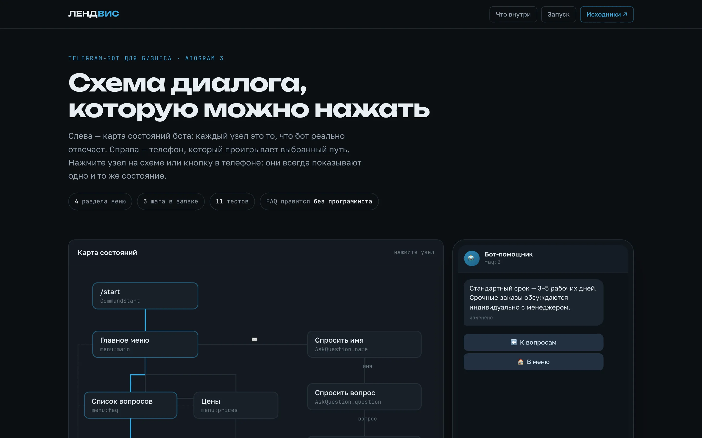
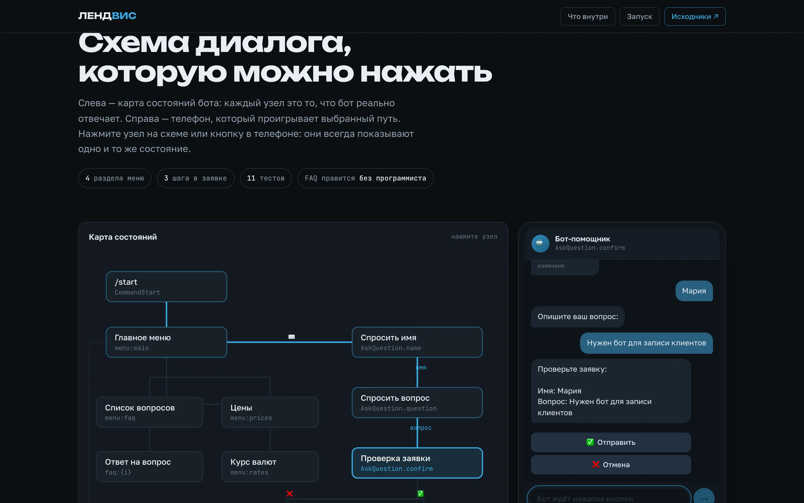

# Telegram-бот для малого бизнеса (aiogram 3)

**[Открыть интерактивную схему диалога →](https://olegg000.github.io/python-faq-bot/)**

> **EN (summary).** A Telegram assistant bot for small businesses, built with
> aiogram 3: an inline menu (FAQ, prices, lead capture, currency rates), FAQ
> answers editable in a plain JSON file, a multi-step lead dialog stored to
> disk, and currency rates behind a swappable provider interface. Covered by 11
> pytest tests that need neither network nor a real token. The live page above
> shows the bot's state machine next to a working phone: click a node on the
> map or a button in the chat — both always show the same state.

[](https://olegg000.github.io/python-faq-bot/)

Бот-помощник, который отвечает на частые вопросы клиентов, показывает цены,
принимает заявки и показывает актуальные курсы валют. Готовый каркас, который
быстро настраивается под любой бизнес: доставка, услуги, магазин, салон.

## Возможности

- **Inline-меню** по команде `/start` — FAQ, цены, заявка, курс валют
- **FAQ** — вопросы кнопками, ответы редактируются в обычном JSON-файле без правки кода
- **Заявки** — диалог в несколько шагов (FSM): имя → вопрос → подтверждение;
  заявки сохраняются в `data/leads.json` с контактом клиента и временем
- **Курс валют** — интеграция с внешним API за единым интерфейсом `RateProvider`:
  демо-режим без сети или реальные курсы через exchangerate API (переключается конфигом)
- **Тесты** — pytest покрывает FSM-сценарий целиком, FAQ и провайдеры курсов;
  работают без сети и без реального токена

## Витрина

Страница [«Схема диалога»](https://olegg000.github.io/python-faq-bot/) показывает
карту состояний бота рядом с работающим телефоном. Нажатие узла на схеме и
нажатие кнопки в чате приводят к одному и тому же состоянию, а тексты, вопросы
FAQ и шаги заявки взяты один в один из кода и `data/faq.json`.

| Ответ из FAQ | Сценарий заявки |
|---|---|
|  |  |


Диалог на странице повторяет логику бота, но не подключается к Telegram — это
демонстрация сценария, а не рабочий бот в браузере.

## Структура проекта

```
python-faq-bot/
├── bot/
│   ├── __main__.py     # точка входа (python -m bot)
│   ├── config.py       # конфигурация из переменных окружения
│   ├── handlers.py     # все хендлеры: меню, FAQ, заявки, курсы
│   └── rates.py        # RateProvider: demo + exchangerate API
├── data/
│   ├── faq.json        # вопросы и ответы FAQ (редактируется без кода)
│   └── leads.json      # заявки клиентов (создаётся автоматически)
├── tests/              # юнит-тесты (pytest)
├── docs/               # витрина проекта (GitHub Pages)
├── .env.example        # образец конфигурации
└── requirements.txt
```

## Запуск

```bash
git clone https://github.com/Olegg000/python-faq-bot.git
cd python-faq-bot

python3 -m venv venv
source venv/bin/activate      # Windows: venv\Scripts\activate
pip install -r requirements.txt

cp .env.example .env          # вписать свой токен от @BotFather
python -m bot
```

Переменные окружения (файл `.env`):

| Переменная | Значение |
|---|---|
| `BOT_TOKEN` | токен бота от [@BotFather](https://t.me/BotFather) |
| `RATE_PROVIDER` | `demo` — курсы без сети, `exchangerate` — реальный API |

## Тесты

```bash
pytest
```

Тесты не требуют ни сети, ни токена: хендлеры проверяются на замоканных
message/callback, FSM — на in-memory хранилище aiogram.

## Кастомизация под заказчика

- **FAQ и ответы** — правится файл `data/faq.json`, код трогать не нужно
- **Тексты и цены** — константы в начале `bot/handlers.py`
- **Источник курсов** — любой API подключается одной реализацией интерфейса
  `RateProvider` в `bot/rates.py` (метод `get_rates()`)
- **Хранение заявок** — сейчас JSON-файл; легко заменяется на Google Sheets,
  БД или отправку менеджеру в Telegram
- Легко добавляются новые пункты меню, уведомления менеджеру, админ-панель
